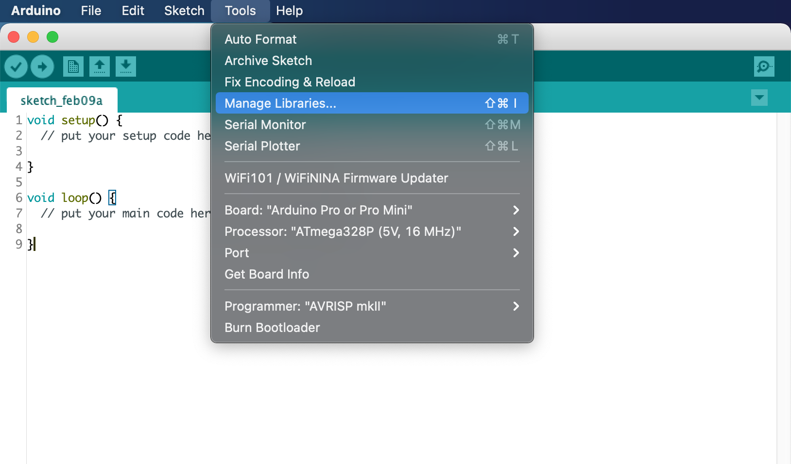
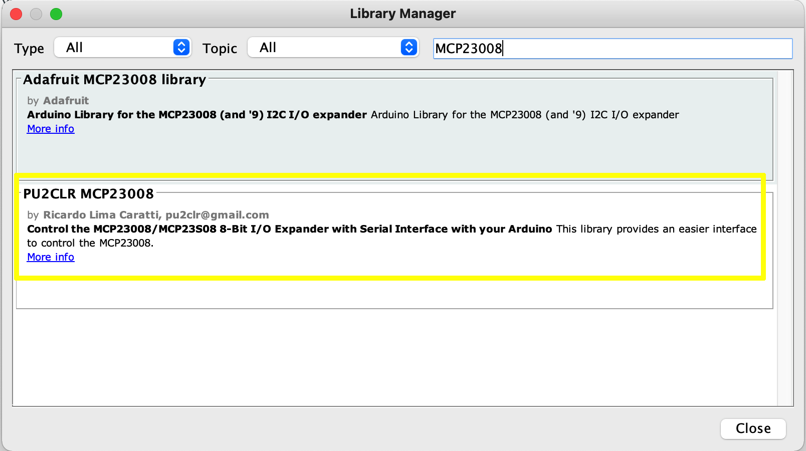
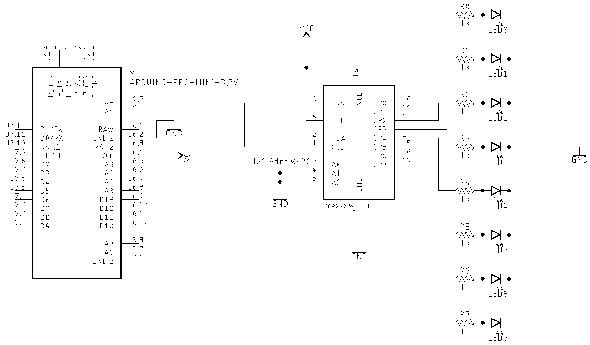
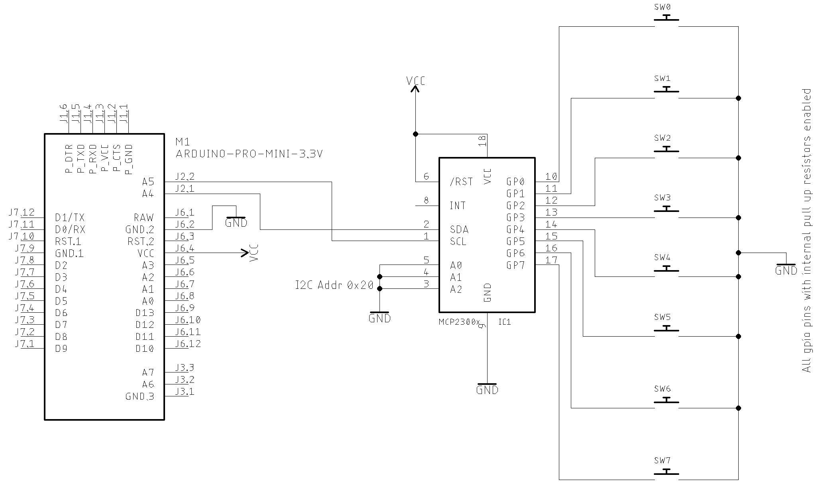
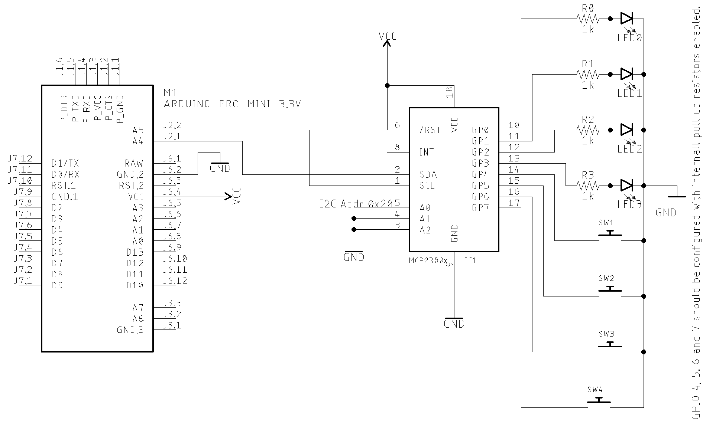
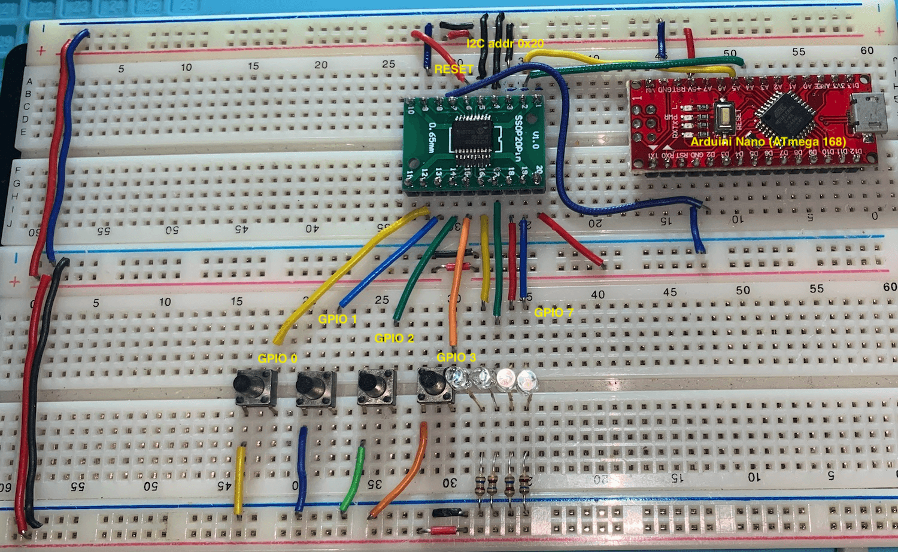
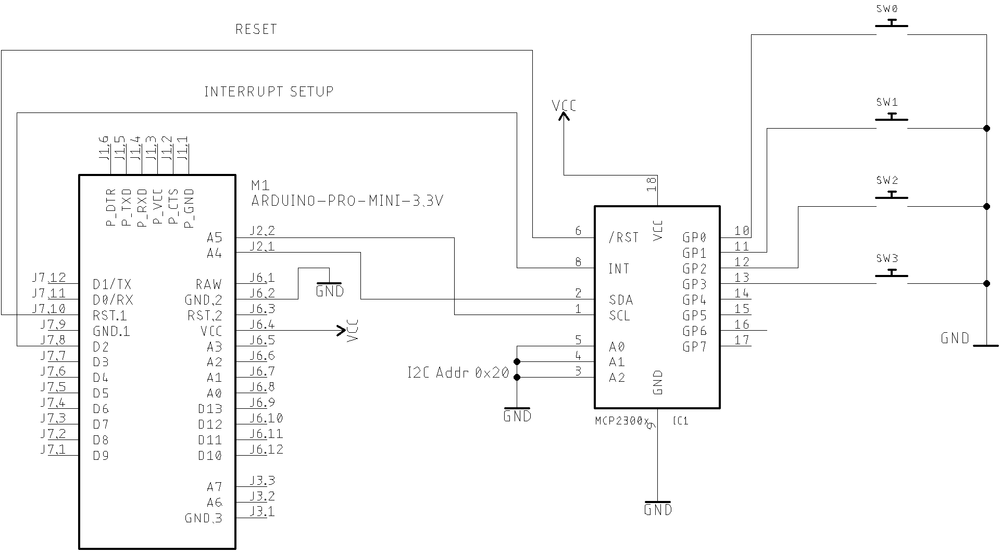

# [PU2CLR - MCP23008 Arduino Library](https://pu2clr.github.io/MCP23008/)

It is an Arduino Library to control the MCP23008 8-Bit I/O Expander. 

The MCP23008 device provides 8-bit, general purpose, parallel I/O expansion. It can be controlled via I²C bus applications. It is a great and inexpensive device that allow you to add more peripherals to be controlled by your Arduino board via I²C protocol.

Some Arduino projects may require more pins than the Arduino actually has. In these cases, you can use up to 8 MCP23008 devices using only the I²C bus (two Arduino pins) and add up to 64 input / output ports to your project. 


This Arduino library implements the most important functions available on MCP23008 device  and can be freely distributed using the MIT Free Software model. 

[Copyright (c) 2021 Ricardo Lima Caratti](https://pu2clr.github.io/MCP23008/#mit-license).

## Contents

1. [License Copyright](https://pu2clr.github.io/MCP23008/#mit-license)
2. [Thanks](https://pu2clr.github.io/MCP23008/#thanks)
3. [Labrary Features](https://pu2clr.github.io/MCP23008/#labrary-features)
4. [Library Installation](https://pu2clr.github.io/MCP23008/#library-installation)
5. [Other Arduino Libraries developed by the Author](https://pu2clr.github.io/MCP23008/#other-arduino-libraries-developed-by-the-author)
7. [API documentation](https://pu2clr.github.io/MCP23008/extras/apidoc/html/)
8. [Basic Schematic](https://pu2clr.github.io/MCP23008/#basic-schematic)
9. [Internal Interrupt setup](https://pu2clr.github.io/MCP23008/#internal-interrupt-setup) 
10. [MCP23008 reset control](https://pu2clr.github.io/MCP23008/#mcp23008-reset-control)
11. [References](https://pu2clr.github.io/MCP23008/#references)


## MIT License 

Copyright (c) 2019 Ricardo Lima Caratti

Permission is hereby granted, free of charge, to any person obtaining a copy of this software and associated documentation files (the "Software"), to deal in the Software without restriction, including without limitation the rights to use, copy, modify, merge, publish, distribute, sublicense, and/or sell copies of the Software, and to permit persons to whom the Software is furnished to do so, subject to the following conditions:

The above copyright notice and this permission notice shall be included in all copies or substantial portions of the Software.

THE SOFTWARE IS PROVIDED "AS IS", WITHOUT WARRANTY OF ANY KIND, EXPRESS OR IMPLIED, INCLUDING BUT NOT LIMITED TO THE ARRANTIES OF MERCHANTABILITY, FITNESS FOR A PARTICULAR PURPOSE AND NONINFRINGEMENT. IN NO EVENT SHALL THE AUTHORS OR COPYRIGHT HOLDERS BE LIABLE FOR ANY CLAIM, DAMAGES OR OTHER LIABILITY, WHETHER IN AN ACTION OF CONTRACT, TORT OR OTHERWISE, ARISING FROM, OUT OF OR IN CONNECTION WITH THE SOFTWARE OR THE USE OR OTHER DEALINGS IN THE SOFTWARE.

## Thanks

* Mrs. [Nancy Daniels Yoga](https://github.com/LadyRoninEngineer/Si473x) for sharing experiences and suggestions about the MCP23008 applications.
*  [D. Scholz](https://github.com/dude789) for the I2C clock method suggestion and implementation

## Labrary Features

This library uses the I²C communication protocol and implements most important functions offered by MCP23008 device from MicroChip. It also has primitive functions that make it easier to implement commands that may not have been implemented yet. The main features implemented can be seen below:

* GPIO individual control (8 I/O pins)
* Reading and writing Access to all registers (0x00 ~ 0xA) 
* Internal pull up GPIO resistors control
* I²C address customization (0x20 ~ 0x27)
* Internal Interrupt feature setup
* Reset control

## Demo video 



[See on Youtube](https://youtu.be/rNnMtvlUPgk)
<BR>

### Registers

This library has two basic function that you can use to control everything on MCP23008. You can use [getRegister](https://pu2clr.github.io/MCP23008/extras/apidoc/html/class_m_c_p.html#a490e4a6820e3a2e0dd86c1a7aa5bb920) and [setRegister](https://pu2clr.github.io/MCP23008/extras/apidoc/html/class_m_c_p.html#aba8f4501efb5a9772a5b7ec7a428ac4d) methods to setup the registers below. Also this library has other functions that make the job easier to build applications based on Arduino and MCP23008 devices. See [API documentation](https://pu2clr.github.io/MCP23008/extras/apidoc/html/).

| Register | Value | Description |
| -------- | ----- | ------------|
| IODIR    | 0x00  | Controls the direction of the data I/O. When  a  bit  is  set,  the  corresponding  pin  becomes  an input.  When  a  bit  is  clear,  the  corresponding  pin becomes an output.|
| IPOL     | 0x01  | The IPOL  register  allows  the  user  to  configure  thepolarity on the corresponding GPIO port bits.|
| GPINTEN  | 0x02  | The GPINTEN register controls the interrupt-on-change feature for each pin. |
| DEFVAL   | 0x03  | The default  comparison  value  is  configured  in  the DEFVAL register.|
| INTCON   | 0x04  | The INTCON register controls how the associated pin value is compared for the interrupt-on-change feature. |
| IOCON    | 0x05  | The IOCON register contains several bits for configuring the device. |
| GPPU     | 0x06  | The GPPU register controls the pull-up resistors for the port  pins. |
| INTF     | 0x07  | The INTF register reflects the interrupt condition on the port pins of any pin that is enabled for interrupts via the GPINTEN register.|
| INTCAP   | 0x08  | The INTCAP register captures the GPIO port value at the  time  the  interrupt  occurred. |
| GPIO     | 0x09  | The GPIO  register  reflects  the  value  on  the  port. |
| OLAT     | 0x0A  | The OLAT  register  provides  access  to  the  output latches. |


Also this library has other functions that make the job easier to build applications. See [API documentation](https://pu2clr.github.io/MCP23008/extras/apidoc/html/).


## Library Installation

__Under construction..__ 

You can install this library on your Arduino environment using different methods. The best ways to do that are described below.  

### Installing via Arduino IDE

This is the easiest method to install this library.

On Arduino IDE, select the __"Manager Libraries..."__ item and look for MCP23008. Finally select "PU2CLR MCP23008". The images below show the installation process. 


#### Going to Manager libraries...




#### Looking for MCP23008




#### Checking the PU2CLR_MCP23008 examples


#### More information

See also [Installing an Arduino Library ](https://learn.sparkfun.com/tutorials/installing-an-arduino-library/using-the-arduino-library-manager)


### Installing via this repository 

First, you have to [download](https://github.com/pu2clr/MCP23008/archive/main.zip) this library in zip format. 
After, unzip the MCP23008-master.zip file in your Arduino Library folder. 

* On __Windows__: "My Documents\Arduino\libraries"
* On __MAC OS__: ˜/Documents/Arduino/libraries
* On __Linux__: ˜/Documents/Arduino/libraries

With that approach, you will have the __most current version__ of the library. However, __it may not be the most stable version__. This is because the current version is always in development. [Prefer releases](https://github.com/pu2clr/MCP23008/releases).
Do you need some old version (release) of this library?  If yes, [check here](https://github.com/pu2clr/MCP23008/releases). 


## Other Arduino Libraries developed by the Author

* [PU2CLR Si4735 Library for Arduino](https://pu2clr.github.io/SI4735/). This library was built based on “Si47XX PROGRAMMING GUIDE; AN332” and it has support to FM, AM and SSB modes (LW, MW and SW). It also can be used on all members of the SI47XX family respecting, of course, the features available for each IC version;
* [PU2CLR SI4844 Arduino Library](https://github.com/pu2clr/SI4844). This is an Arduino library for the SI4844, BROADCAST ANALOG TUNING DIGITAL DISPLAY AM/FM/SW RADIO RECEIVER,  IC from Silicon Labs.  It is available on Arduino IDE. This library is intended to provide an easier interface for controlling the SI4844.
* [PU2CLR AKC695X Arduino Library](https://pu2clr.github.io/AKC695X/). The AKC695X is a family of IC DSP receiver from AKC technology. The AKC6955 and AKC6959sx support AM and FM modes. On AM mode the AKC6955 and AKC6959sx work on LW, MW and SW. On FM mode they work from 64MHz to 222MHz.
* [PU2CLR KT0915 Arduino Library](https://pu2clr.github.io/KT0915/). The KT0915 is a full band AM (LW, MW and SW) and FM DSP receiver that can provide you a easy way to build a high quality radio with low cost.
* [PU2CLR BK108X](https://pu2clr.github.io/BK108X/). The BK1086 and BK1088 are DSP receivers from BAKEN. The BK1088 is a BROADCAST FM and AM (LW, MW and ) RECEIVER and BK1086 is a subset of the BK1088 (it does not have LW and SW acording to the Datasheet).
* [PU2CLR RDA5807 Arduino Library](https://pu2clr.github.io/RDA5807/). The RDA5807 is a FM DSP integrated circuit receiver (50 to 115MHz) with low noise amplifier support. This device requires very few external components if compared with other similar devices. It also supports RDS/RBDS functionalities, direct auto gain control (AGC) and real time adaptive noise cancellation function.
* [PU2CLR SI470X Arduino Library](https://pu2clr.github.io/SI470X/). It is a Silicon Labs device family that integrates the complete functionalities for FM receivers, including RDS (Si4703).
* [PU2CLR - PCF8574 Arduino Library](https://pu2clr.github.io/PCF8574/). It is an Arduino Library to control the PCF8574 8-Bit I/O Expander. The PCF8574 device provides 8-bit, general purpose, parallel I/O expansion. It can be controlled via I²C bus applications. It is a great and inexpensive device that allow you to add more peripherals to be controlled by your Arduino board via I²C protocol. 


## Basic schematic

The image below shows a basic MCP23008 application with LED. You can control up to 8 LEDs. The I²C bus address is set to 0x20. You can select another I²C address by dealing with the A0,A1 and A2 pins (from 0x20 to 0x27). This circuit uses the MCP23008 GPIO PINs as output.   

### GPIO as output setup




#### Arduino setup suggestion

```cpp
#include <pu2clr_mcp23008.h>

MCP mcp;

void setup() {
  mcp.setup(0x20, 0); // I²C Address 0x20 and all GPIO pins configured to output
```

You also can use the methos setRegister as shown below (See MCP23008 IODIR register)

```cpp
    mcp.setRegister(REG_IODIR, 0B00000000);    // Sets  all GPIO pins to output
```

#### Output setup example

```cpp
#include <pu2clr_mcp23008.h>

MCP mcp;

void setup() {
    mcp.setup(0x20,0);   // I²C address 0x20; All GPIO port/pin are configured as output
}

void loop() {
    for (uint8_t i = 0; i < 8; i++)
    {
        mcp.turnGpioOn(i); // Turns the GPIO / port i on
        delay(200);
        mcp.turnGpioOff(i); // Turns the GPIO / port i off
        delay(200);
    }
    delay(2000);
    for (uint8_t i = 0; i < 8; i++)
    {
        mcp.turnGpioOn(i); // Turns the GPIO / port i on
        delay(300);
    }
    delay(2000);
    for (uint8_t i = 0; i < 8; i++)
    {
        mcp.turnGpioOff(i); // Turns the GPIO / port i off
        delay(300);
    }
    delay(2000);
}
```


### GPIO as input setup





#### Arduino setup suggestion

```cpp
void setup() {
  mcp.setup(0x20, 0B11111111); // I²C Address 0x20 and all GPIO pins configured to input
```

You also can use the methos setRegister as shown below (See MCP23008 IODIR register)

```cpp
    mcp.setRegister(REG_IODIR, 0B11111111);    // Sets  all GPIO pins to input
```


### GPIO as input and output setup





```cpp
#include <pu2clr_mcp23008.h>

MCP mcp;

void setup() {
  mcp.setup(0x20, 0B00001111); // I²C Address 0x20, GPIO 0-3 are inputs and  4-7 are outputs
```

You also can use the methos setRegister as shown below (See MCP23008 IODIR register)

```cpp
    mcp.setRegister(REG_IODIR, 0B00001111);    // Sets  GPIO pins 0-3 to input and  GPIO pins 4-7 to output
```

#### [See input/output sketch example](https://github.com/pu2clr/MCP23008/tree/main/examples/mcp_poc_03_input_output) 


## Prototype 

The prototype below is based on the GPIO as input and output setup schematic




## Internal Interrupt setup

The MCP23008 device has internal interrupt support. That means you can know instantly when a GPIO configured as input changed its status (from high to low or from low to high). This library implements some functions to support MCP23008 internal interrupts. You also can configure the internal interrupt behaviour. See the [MCP23008 library API for more details](https://pu2clr.github.io/MCP23008/extras/apidoc/html/).  See also [the examples mcp_poc_interrupt01 ans mcp_poc_interrupt01](examples/). 

The code below shows how to setup internal interrupt on given GPIO pin. Observe the MCP23008 internal pullup configured before configuring the interrupt. In this setup, the gpio.

It is important to know: __only  pins  configured  as  inputs  can  cause  interrupts. Pins configured as outputs have no affect on INT. After an interrupt is triggered, you can not deal with other interrupt until GPIO or INTCAP registers is read. Only reading GPIO or INTCAP registers  will clean the interrupt status and will make a new interrupt possible__. 


```cpp

  mcp.pullUpGpioOn(MCP_GPIO1);          // Enables internal pullup resistor on gpio pin 1
  mcp.pullUpGpioOn(MCP_GPIO3);          // Enables internal pullup resistor on gpio pin 3
  
  mcp.setInterrupt(INTERRUPT_INTPOL_ACTIVE_HIGH, INTERRUPT_ODR_OPEN_DRAIN); // Defines the behaviour of the interrupt

  // GPIO pin 1 setup
  mcp.interruptGpioOn(MCP_GPIO1, HIGH); // Sets the GPIO pin 1 to deal with interrupt. The pin 1 will be compared with the value 1 (HIGH). It will be launch an interrupt if the pin 1 goes to level 0 (LOW).

  // GPIO pin 5 setup
  mcp.interruptGpioOn(MCP_GPIO3, HIGH); // Sets the GPIO pin 3 to deal with interrupt. The pin 3 will be compared with the value 1 (HIGH). It will be launch an interrupt if the pin 1 goes to level 0 (LOW).

```

Again. see also [the examples mcp_poc_interrupt01 ans mcp_poc_interrupt02](examples/) for more details. The schematic below can be used to check MCP23008 interrupt applications.





## MCP23008 reset control

In most applications you can use the MC23008 reset pin directly connected to the VCC. __You can also connect the MCP23008 RESET pin to the Arduino RESET pin (It is better than previous setup)__. 
However, you might need to control the reset  via your Arduino sketch. If so, check the setup and reset functions to do that on [MCP23008 library API Documentation](https://pu2clr.github.io/MCP23008/extras/apidoc/html/).  The code below shows the RESET setup on Arduino and MCP23008.

```cpp
#include <pu2clr_mcp23008.h>

#define RESET_PIN 12  // Arduino pin 12 will be used to control the MCP23008 RESET

MCP mcp;


void setup() {

  mcp.setup(0x20, 0B00001111, RESET_PIN);  // GPIO 0 to 3 are input (buttons) and 4 to 7 are output (LEDs)
  mcp.setRegister(REG_GPPU, 0B00001111); // sets GPIO 0 to 3 with internal pull up resistors

  .
  .  
  . 
  mcp.reset();  // the setup function above already called the MCP23008 reset. But you can also call reset function if you need it in other situation

```


## References 

* [MicroChip - MCP23008/MCP23S08 - 8-Bit I/O Expander with Serial Interface](https://ww1.microchip.com/downloads/en/DeviceDoc/21919e.pdf)
* [Nancy Daniels Yoga](https://github.com/LadyRoninEngineer/)  


